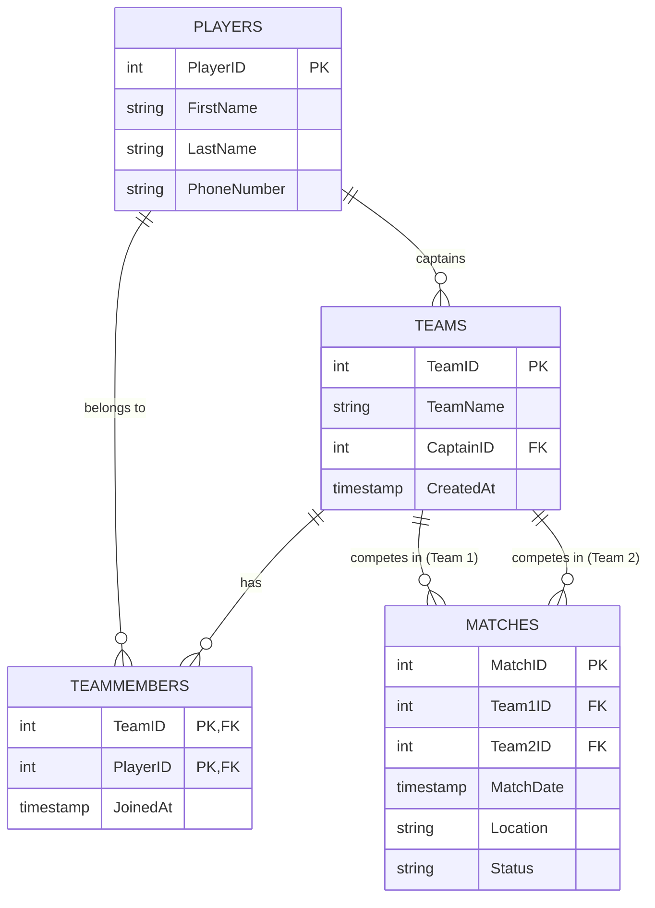

# Database ER Diagram

This document contains the Entity Relationship Diagram for the Tournament Database.

```mermaid
erDiagram
    PLAYERS ||--o{ TEAMS : "captains"
    PLAYERS ||--o{ TEAMMEMBERS : "belongs to"
    TEAMS ||--o{ TEAMMEMBERS : "has"
    TEAMS ||--o{ MATCHES : "competes in (Team 1)"
    TEAMS ||--o{ MATCHES : "competes in (Team 2)"

    PLAYERS {
        int PlayerID PK
        string FirstName
        string LastName
        string PhoneNumber
    }

    TEAMS {
        int TeamID PK
        string TeamName
        int CaptainID FK
        timestamp CreatedAt
    }

    TEAMMEMBERS {
        int TeamID PK, FK
        int PlayerID PK, FK
        timestamp JoinedAt
    }

    MATCHES {
        int MatchID PK
        int Team1ID FK
        int Team2ID FK
        timestamp MatchDate
        string Location
        string Status
    }
```
