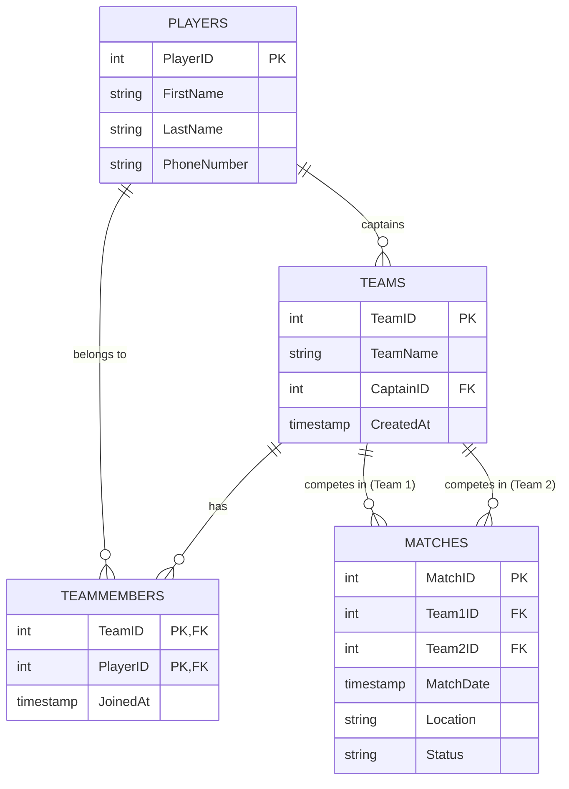

# System Design

## System Architecture
The Tournament Management System follows a 3-tier architecture:
1.  **Presentation Tier**: Built with React and TypeScript, styled with Tailwind CSS v4 and Material UI.
2.  **Logic Tier**: A RESTful API built using FastAPI (Python), handling business logic and data validation.
3.  **Data Tier**: A PostgreSQL database for persistent storage.

## Technology Stack
- **Frontend**: React 19, Vite, TypeScript, Tailwind CSS, Material AI components.
- **Backend**: Python 3.x, FastAPI, SQLAlchemy, Pydantic.
- **Database**: PostgreSQL with structured SQL schema.

## Database Schema (ERD)

