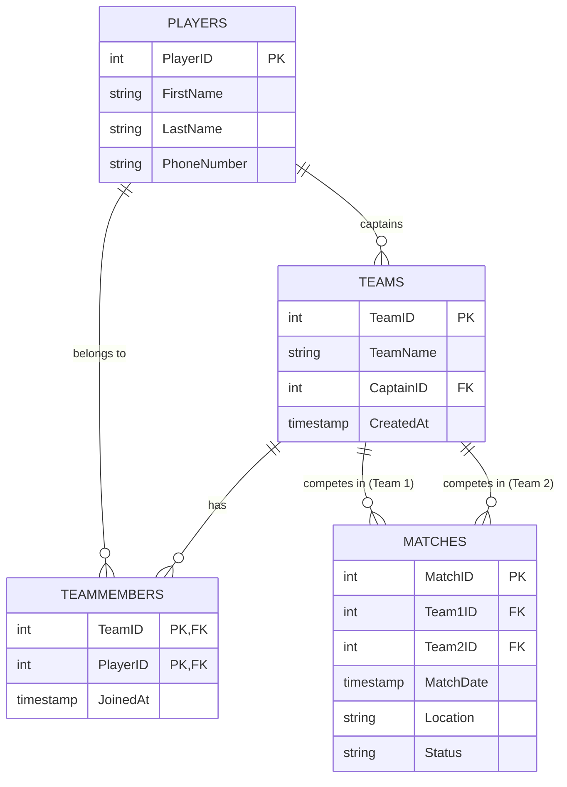

# Activate Python
use to activate python enviorment using 

`.\.venv\Scripts\activate`

# How to run api
cd api 
fastapi dev main.py

# How to run app
cd app
npm run dev

# SQl
Structured query language

# technologies used to create this system 

User Interface is Build on React and Tailwind css

Database is created on postgresql (Structured querry Language ) 

# University Documentation

Comprehensive university-style project documentation is available in the [**doc/**](./doc/index.md) folder.

- [Introduction](./doc/introduction.md)
- [System Design](./doc/system_design.md)
- [User Manual](./doc/user_manual.md)

# Database Schema

Below is the Entity Relationship Diagram (ERD) for the Tournament Database.

Detailed information can be found in [ER_DIAGRAM.md](./ER_DIAGRAM.md).
